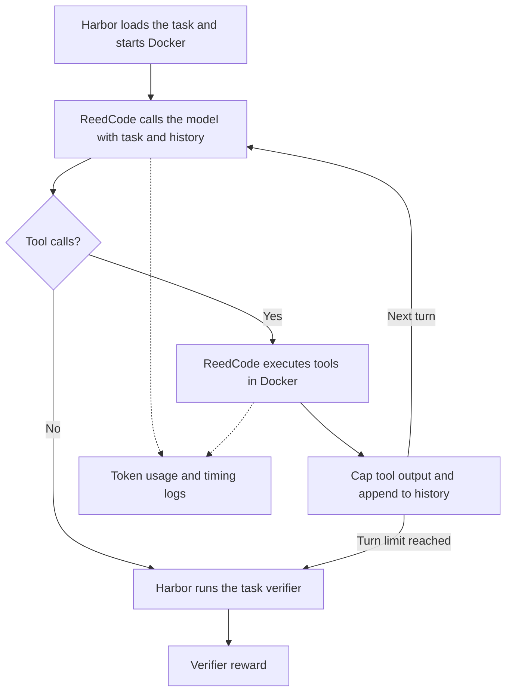

# ReedCode

A small coding-agent harness with tool execution, per-call tracing, and Harbor integration.

Built after becoming interested in the harness ↔ inference boundary in long-running coding agents.

ReedCode studies how much tool output a coding agent needs to keep. It compares head-only and head+tail retention, records the text budget used at each step, and separates model usage from tool execution and verifier results.

The current runner supports repeated, interleaved comparisons. The saved results below come from an earlier pilot; they do not establish a token or latency improvement caused by truncation.

## How it works



Harbor manages the task's setup, deadline, and verification. ReedCode manages the model calls, tools, and history. Errors can end a run early; Harbor records evaluation exceptions separately from rewards.

[`reedcode_harbor_agent.py`](reedcode_harbor_agent.py) calls the model with a task, conversation history, and three tools: `read_file`, `write_file`, and `bash`. After each complete response, it executes any tool calls and appends their results to the history. It stops when the model returns without a tool call or reaches a turn or output-token limit.

The harness runs on the host. Commands run in a Docker task environment through Harbor's [`BaseEnvironment`](https://docs.harborframework.com/core-concepts/agents/custom-agents). Harbor runs the verifier after the agent finishes; the model saying it is done does not determine the reward.

Instructions and tool schemas stay fixed across calls. History includes the model's full output, including reasoning items and tool-call IDs. Tools run sequentially. There is no context compaction or parallel-agent scheduler.

Malformed arguments, invalid file paths, command failures, and recognized timeouts are returned to the model as tool results. API errors and other infrastructure failures propagate to Harbor. Cancellation also propagates so Harbor can enforce the task deadline.

An output-token limit is a normal budget stop. Its usage stays in the trace, tools from the cut-off response are skipped, and Harbor verifies the current workspace. The trial stays in the analysis with its verifier reward. Reports show limit-hit counts and rates alongside passes; hitting the limit does not automatically mean the repair failed.

The file tools check paths lexically, including absolute paths inside the workspace. This does not prevent symlink escape, and `bash` can access the rest of the container. Run the agent in disposable containers without sensitive mounts. The earlier host prototype is kept in [`archive/`](archive/README.md).

## Measurements

The harness writes a JSONL trace with token usage and latency for each model call, duration, original and retained output sizes, policy, and a `truncated` flag for each tool call, and a final task summary. Harbor records the verifier reward separately.

| Metric | Definition |
| --- | --- |
| Input, cached, and output tokens | API-reported usage summed across completed calls |
| Fresh input tokens | Input tokens minus cached input tokens |
| Model latency | Time spent awaiting complete API responses, summed per task |
| Tool latency | Time spent executing tools, summed per task |
| Tool-output bytes | UTF-8 bytes returned to the model after truncation, including formatting |
| Harbor job runtime | Time from job start to finish, including setup and verification |

Model latency includes network, service, and SDK overhead. It does not separate prefill from decode. Hosted-API traces do not measure GPU time, server queue time, TTFT, ITL, or KV residency. The optional vLLM collector adds server phase times and sampled cache occupancy, described below. Reported cached tokens are useful workload data, but they do not tell us how much GPU compute was saved.

`MAX_TOOL_OUTPUT` limits retained content to N characters. `OUTPUT_POLICY=head` keeps the beginning; `head_tail` splits the budget evenly between the beginning and end (the extra character goes to the head for odd budgets). The exit-code prefix and truncation marker add a little beyond that limit. Output is collected before truncation, so this setting does not bound subprocess memory use. Head-only retention can cut off diagnostics at the end. The exit code remains visible under both policies. Sizes before retention refer to the observation text, excluding the exit-code prefix; returned bytes include all formatting.

## Experiment method

Three conditions use the same model, tools, turn limit, timeout, and task snapshot:

| Condition | Retained characters |
| --- | --- |
| `head_20k` | First 20,000 |
| `head_2k` | First 2,000 |
| `head_tail_2k` | First 1,000 and last 1,000 |

The real-suite schedule has ten tasks, five repetitions, and all three conditions: 150 trials. Each task/repetition is a block with its conditions run next to each other in varied order. The runner saves the schedule before running, downloads each task once, and checks its snapshot before every trial. Oracle checks must pass on every snapshot before any model calls begin. The schedule seed controls ordering, not model randomness.

Reports show passes, exceptions, truncation counts, and paired differences in tokens, latency, model calls, and tool calls. They also report an overall estimate: average the differences within each task, then give each task equal weight. Its 95% interval resamples tasks, rather than treating repeated runs as independent tasks.

Missing tasks and pairs remain visible. Per-task intervals need at least five usable pairs; the pooled interval needs at least five tasks. A single synthetic task cannot provide an across-task interval. The primary retention comparison is `head_tail_2k` against `head_2k`. Five repetitions are a starting point, not a guarantee of precision. See the [protocol](experiments/PROTOCOL.md) for task selection and interpretation.

The revised synthetic task and retention policies have been checked without model calls. No model results have been collected under this protocol yet. Model and tool call differences measure extra work; they do not identify individual recovery calls.

## Pilot results

Both suites used `gpt-5.6-terra`, with the same tools and verifiers within each suite. All 20K runs happened before the 2K runs. Oracle runs passed the local tasks and the three selected Terminal-Bench tasks before the comparisons.

### Synthetic bugfix

The original task, preserved in [`evals/noisy-bugfix-pilot`](evals/noisy-bugfix-pilot), prints 150 diagnostic lines before a failing pricing test. At a 2K head-only cap the agent cannot see the pytest diagnostics or summary. Agents can inspect the source or rerun a more focused command; the current harness also keeps the exit code visible. Passing this task shows that the agent can work around hidden diagnostics; it does not establish that important information was safely discarded. The original verifier checked three assertions rather than running pytest.

There were three runs per cap, using harness 0.1.0. All six passed.

| Mean per run | 20K cap | 2K cap | Change |
| --- | ---: | ---: | ---: |
| Input tokens | 13,881.7 | 5,532.0 | -60.1% |
| Cached tokens | 9,464.3 | 1,948.3 | -79.4% |
| Fresh tokens | 4,417.3 | 3,583.7 | -18.9% |
| Tool-output bytes | 18,607.7 | 5,096.7 | -72.6% |
| Model latency | 13.21 s | 11.99 s | -9.3% |
| Model calls | 6.00 | 6.00 | 0.0% |
| Tool calls | 7.00 | 6.33 | -9.5% |

### Terminal-Bench

The aggregate input difference was −61.3%, but the cap cannot explain the whole change: `regex-log` never hit either cap. With one run per task and all 20K runs first, the cap effect cannot be separated from trajectory variation or service conditions.

The first batch exposed problems with absolute workspace paths, command timeouts, and reporting failed trials. After fixing those, I ran each task once per cap with harness 0.2.0. All six final runs passed, with no Harbor exceptions.

| Task | Cap | Input tokens | Fresh tokens | Model latency |
| --- | ---: | ---: | ---: | ---: |
| `extract-elf` | 20K | 45,203 | 11,022 | 64.88 s |
| `extract-elf` | 2K | 33,427 | 9,262 | 93.14 s |
| `regex-log` | 20K | 67,217 | 8,304 | 112.84 s |
| `regex-log` | 2K | 5,691 | 3,212 | 38.57 s |
| `sanitize-git-repo` | 20K | 297,390 | 39,873 | 98.23 s |
| `sanitize-git-repo` | 2K | 119,649 | 15,069 | 89.62 s |

| Mean per task | 20K cap | 2K cap | Change |
| --- | ---: | ---: | ---: |
| Input tokens | 136,603.3 | 52,922.3 | -61.3% |
| Cached tokens | 116,870.3 | 43,741.3 | -62.6% |
| Fresh tokens | 19,733.0 | 9,181.0 | -53.5% |
| Output tokens | 5,513.7 | 4,813.0 | -12.7% |
| Tool-output bytes | 39,422.7 | 10,146.7 | -74.3% |
| Model latency | 91.98 s | 73.78 s | -19.8% |
| Tool latency | 16.86 s | 8.52 s | -49.4% |
| Model calls | 12.00 | 9.33 | -22.2% |
| Tool calls | 11.00 | 9.33 | -15.2% |

Total Harbor job runtime fell from 420.01 to 346.12 seconds (17.6%), including setup and verification.

`sanitize-git-repo` accounts for most of the absolute input-token difference. There are also two counterexamples in the per-task results. `extract-elf` used fewer input tokens at 2K but generated more output tokens and took longer. Neither `regex-log` run even hit the smaller cap: the largest returned observations were 426 and 457 bytes. Its large improvement cannot be attributed to truncation.

Three tasks and one run per setting are not enough to separate the cap's effect from stochastic trajectories and changing service conditions. More tasks and repeated, interleaved runs would be needed. These results do not establish 2K as an optimal cap or demonstrate equivalent accuracy across Terminal-Bench.

The synthetic runs used 0.1.0, whose source snapshot was not saved. The current harness is 0.4.1; the saved results have not been rerun with it. Real tasks were fetched at `latest`; their checksums are recorded, but task contents and model aliases can change. See [experiment records](experiments/README.md) for the saved traces and reproduction limits.

## Server measurements

The harness also supports a self-hosted vLLM model through Chat Completions. With a metrics endpoint configured, each model call records server-side prefill and decode times, prefix-cache counters, and sampled KV cache occupancy. These are separate from client API latency. The report includes phase-time differences and sampled KV maxima when the collection windows pass the attribution checks.

The adapter and collector have offline tests. GPU measurements still need a dedicated server; none are reported here yet. See [the vLLM setup](docs/self-hosted.md) for the command, metric definitions, and cache policy.

## Next experiments

- Run the prepared three-condition study, starting with the revised synthetic task before the ten-task suite.
- Use the results to decide whether semantic retention of errors, test results, and code warrants another condition.
- Eventually, test harness-provided lifecycle hints to an inference scheduler, such as when an agent starts a tool call and expects to need the model again.

## Codex profile

I also profiled a separate Codex run on `terminal-bench/make-mips-interpreter` with `gpt-5.6-terra`. It made progress on a MIPS interpreter but failed the verifier, with reward 0 and no Harbor exception.

| Metric | Value |
| --- | ---: |
| Commands / failed commands | 20 / 9 |
| File-change events | 10 |
| Cumulative input tokens | 1,598,392 |
| Cached input tokens | 1,528,576 (95.63%) |
| Fresh input tokens | 69,816 |
| Output tokens | 16,912 |
| Reported reasoning output tokens | 6,332 |
| Session-reported duration | 698.05 s |
| Session-reported time to first token | 6.71 s |

This run is what made repeated context and prefix reuse interesting to investigate. These are Codex's measurements, not an improvement made by ReedCode. The TTFT value is a session field, not a per-call latency distribution.

[`profile_trajectory.py`](profile_trajectory.py) reads this session format and takes the final cumulative usage record. The [saved profile](experiments/codex_profile/profile.json) includes the source-session hash. Reasoning tokens should not be added to output tokens as a separate total.

## Running it

Requires Python 3.12+, [uv](https://docs.astral.sh/uv/), and Docker for evaluations. Harbor is pinned to 0.23.0 and the OpenAI SDK to 2.54.0.

```bash
uv sync --locked

# Summarize the saved runs. No API key or Docker needed.
python3 summarize_ab.py
python3 summarize_real_ab.py

# Offline tests
uv run python -m unittest discover -s tests -v

# Check the revised synthetic task without model calls
uv run harbor run -p evals/noisy-bugfix -a oracle
docker build -t reedcode-noisy-bugfix-v2 evals/noisy-bugfix/environment
uv run python tests/check_synthetic_container.py

# Inspect the 150-trial schedule without downloads or model calls
uv run python run_experiments.py real --dry-run

# Download and oracle-check the ten tasks without model calls
uv run python run_experiments.py real --check-only
```

For model runs, set `OPENAI_API_KEY` in your environment. The default model is `gpt-5.6-terra`; set `MODEL` to another Responses-compatible model if your account cannot access it. Record that change when comparing results.

```bash
PYTHONPATH="$PWD" uv run harbor run -p evals/hello \
  --agent reedcode_harbor_agent:ReedCodeAgent \
  --model "${MODEL:-gpt-5.6-terra}"

# These use model API credits: 15 synthetic trials, then 150 real-task trials
bash run_ab.sh
bash run_real_ab.sh

# Use the output directory printed by the runner
python3 summarize_real_ab.py runs/real-TIMESTAMP

# Profile a compatible Codex session
python3 profile_trajectory.py /path/to/rollout.jsonl
```

New runs go under `runs/`, with full Harbor output in `jobs/`. Both directories are ignored by Git. The saved pilot evidence is left alone. Reporters check trace hashes, retain failed attempts, and leave missing telemetry as unknown. New reports also write `paired_report.json`, including per-task and pooled comparisons. Each invocation creates a new study; interrupted studies are reported as partial and are not silently retried.

| Setting | Default |
| --- | ---: |
| `MAX_TURNS` | 30 model calls |
| `MAX_TOOL_OUTPUT` | 20,000 characters |
| `TOOL_TIMEOUT` | 120 seconds per command |
| `OUTPUT_POLICY` | `head` (`head_tail` also supported) |
| `MODEL_API` | `responses` (`chat` for vLLM) |
| `MAX_OUTPUT_TOKENS` | Unset; provider default |
| `VLLM_METRICS_URL` | Unset; collection disabled |
| `METRICS_SAMPLE_INTERVAL` | 0.1 seconds |

The experiment runner fixes the turn limit and timeout across all conditions. `--model-api` and `--max-output-tokens` apply to every condition; SDK retries are disabled so hidden retries cannot be mistaken for one server request. Harbor also enforces the task's overall deadline. Settings are read when each agent is created; Python callers can pass a `Settings` instance directly.

## Files

- `reedcode_harbor_agent.py`: the Harbor agent.
- `output_policy.py`: retention policies and agent settings.
- `model_backend.py`: Responses and Chat Completions adapters.
- `server_metrics.py`: vLLM metrics collection.
- `archive/agent.py`: the original host prototype, retained for reference.
- `run_experiments.py`: runs the suites and exports results.
- `reporting.py`: shared code for the two summary scripts.
- `profile_trajectory.py`: Codex session profiler.
- `evals/`: smoke test, revised noisy bugfix task, and preserved pilot fixture.
- `experiments/`: saved metrics and verifier results.
- `tests/`: offline harness and reporting tests.
