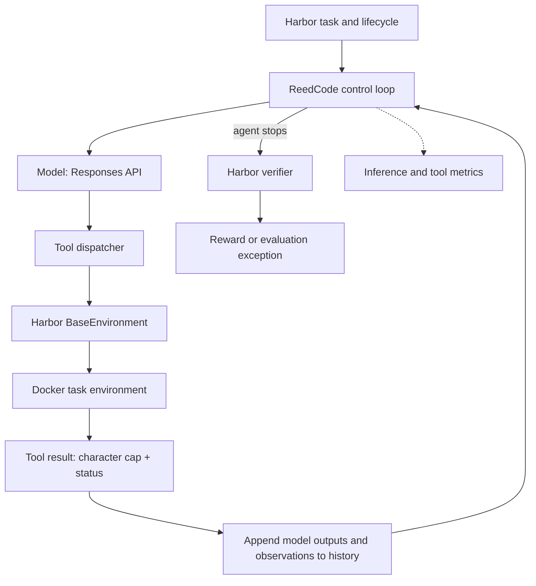

# ReedCode

A minimal instrumented coding-agent harness for studying how harness-level decisions affect agent workloads and inference behavior.

ReedCode implements the model → tool → observation loop, runs as a custom Harbor agent, and records per-call telemetry. A small experiment compares how much tool output the harness retains: **20,000 versus 2,000 characters**.

Across three Terminal-Bench tasks, both configurations passed every verifier. The 2K runs used **61.3% fewer cumulative input tokens** and **53.5% fewer fresh input tokens**, with **19.8% lower mean model-call latency summed per task**. These are observations from one run per task/configuration, not a general speedup or accuracy claim. One task was slower at 2K.

## Why build this?

An agent's inference workload depends on what its harness puts into the next request. Tool observations accumulate in history and can be resubmitted many times. This project makes that relationship measurable:

**observation policy → context shape → input-token workload and reported cache reuse → observed latency and verifier outcome**

Changing the observations can also change the agent's actions and number of steps. That makes an agent evaluation more complicated than timing a fixed prompt.

## Architecture



The harness runs outside the task container. `BaseEnvironment.exec` executes `read_file`, `write_file`, and `bash` operations inside it. Harbor manages the environment and invokes the verifier after the agent phase. See Harbor's [custom-agent interface](https://docs.harborframework.com/core-concepts/agents/custom-agents).

The core loop in [`reedcode_harbor_agent.py`](reedcode_harbor_agent.py) is:

```python
history = [user_instruction]
for turn in range(max_turns):
    response = await model(instructions=stable_instructions,
                           tools=stable_schemas, input=history)
    record_inference_metrics(response)
    history.extend(response.output)
    if not response.tool_calls:
        break
    for call in response.tool_calls:
        observation = await execute_tool(call)
        history.append(tool_result(call.id, observation))
```

This is illustrative pseudocode. The implementation preserves all response output items, including reasoning items, and matches observations to tool-call IDs. Tools execute sequentially; there is no parallel-agent scheduler or context compaction.

**Stopping is not correctness.** `agent_completed` means the model stopped requesting tools. Only the task verifier supplies the reward; missing verifier results remain unknown.

## Instrumentation and boundaries

| Recorded metric | Meaning |
| --- | --- |
| Input / cached / output tokens | API-reported usage, summed over completed model calls |
| Fresh input tokens | Input tokens minus reported cached input tokens |
| Model latency | Wall time around each complete, non-streaming API request; summed per task |
| Tool latency | Time around each tool dispatch; summed per task |
| Tool-output bytes | UTF-8 bytes returned to the model **after truncation**, including formatting |
| Model/tool calls and failures | Control-loop activity and unsuccessful tool results |
| Stop reason / harness wall time | Natural stop, turn limit, cancellation, or error; duration of `run()` |
| Harbor job runtime / reward | Separate Harbor lifecycle timestamps and verifier outcome |

Model latency includes service/network/SDK overhead; it is not isolated prefill or decode time. The harness does not measure GPU-seconds, server queue time, TTFT, ITL, or actual KV residency. Cached-token counts do not directly measure saved GPU compute, and cached input is not free work. A high cache fraction is not itself the optimization target.

`MAX_TOOL_OUTPUT` caps Python string characters in command output, retaining the beginning. The truncation marker and exit-code prefix add characters beyond that value. It is neither a token cap nor a strict final-observation byte limit. Outputs are collected before truncation, so this does not bound subprocess memory use. Important diagnostics near the end can be lost.

Version 0.2.0 converts malformed arguments, invalid file paths, nonzero command exits, and recognized tool timeouts into observations. API failures and unrelated infrastructure errors propagate; cancellation remains cancellable. The trace retains a final summary when `run()` exits, with completed-call totals on aborted runs.

The file-path check is lexical: it permits absolute paths inside the workspace and rejects traversal outside it. It does not prevent symlink escape, and `bash` is unrestricted within the container. Use disposable task environments without host secrets or sensitive mounts. The original [`agent.py`](agent.py) is a host-executing educational prototype, not the benchmark entry point or a sandbox.

## Codex workload profile

A separate Codex run on `terminal-bench/make-mips-interpreter`, using `gpt-5.6-terra`, reported:

| Metric | Value |
| --- | ---: |
| Commands / failed commands | 20 / 9 |
| File-change events | 10 |
| Cumulative input tokens | 1,598,392 |
| Cached input tokens | 1,528,576 (95.63%) |
| Fresh input tokens | 69,816 |
| Output tokens | 16,912 |
| Reasoning output tokens, reported separately | 6,332 |
| Session-reported task duration | 698.05 s |
| Session-reported time to first token | 6.71 s |
| Harbor reward / exceptions | 0 / 0 |

The agent made progress on a MIPS interpreter but did not satisfy the verifier. The repeated input across model calls illustrates why reusable prefixes matter. **These measurements describe Codex; ReedCode did not cause its cache reuse.** The session's TTFT field is not a distribution of per-inference TTFTs.

[`profile_trajectory.py`](profile_trajectory.py) reads the observed Codex session format and uses the final cumulative usage record rather than summing cumulative records. The [saved profile](experiments/codex_profile/profile.json) includes provenance; the raw session is excluded.

## Tool-output experiment

Within each suite, the intended changed setting was `MAX_TOOL_OUTPUT`: 20K versus 2K characters. The model, tools, and task verifiers stayed the same. All 20K runs preceded all 2K runs. Oracle runs validated the local task verifiers and the three selected real tasks before comparison.

### Synthetic noisy bugfix

[`evals/noisy-bugfix`](evals/noisy-bugfix) prints 150 irrelevant diagnostic lines before a failing pricing test. The instruction requires running that command before and after the fix. Three runs per cap used harness **0.1.0**, prior to the robustness changes in the current source.

| Mean per run | 20K | 2K | Change |
| --- | ---: | ---: | ---: |
| Verifier passes | 3/3 | 3/3 | — |
| Input tokens | 13,881.7 | 5,532.0 | −60.1% |
| Cached tokens | 9,464.3 | 1,948.3 | −79.4% |
| Fresh tokens | 4,417.3 | 3,583.7 | −18.9% |
| Tool-output bytes | 18,607.7 | 5,096.7 | −72.6% |
| Model latency | 13.21 s | 11.99 s | −9.3% |
| Model / tool calls | 6.00 / 7.00 | 6.00 / 6.33 | — |

On this deliberately noisy workload, the smaller cap substantially reduced recorded context workload while preserving verifier success in all six runs.

### Three real Terminal-Bench tasks

The first batch exposed path-handling, timeout, and reporting failures. After hardening, harness **0.2.0** ran each task once per cap. These final six runs all received reward 1 with zero evaluation exceptions; individual tools could still fail and recover.

| Task | Input tokens, 20K → 2K | Fresh tokens, 20K → 2K | Model latency, 20K → 2K |
| --- | ---: | ---: | ---: |
| `extract-elf` | 45,203 → 33,427 | 11,022 → 9,262 | 64.88 → **93.14 s** |
| `regex-log` | 67,217 → 5,691 | 8,304 → 3,212 | 112.84 → 38.57 s |
| `sanitize-git-repo` | 297,390 → 119,649 | 39,873 → 15,069 | 98.23 → 89.62 s |

| Mean per task | 20K | 2K | Change |
| --- | ---: | ---: | ---: |
| Verifier passes | 3/3 | 3/3 | — |
| Input tokens | 136,603.3 | 52,922.3 | −61.3% |
| Cached tokens | 116,870.3 | 43,741.3 | −62.6% |
| Fresh tokens | 19,733.0 | 9,181.0 | −53.5% |
| Output tokens | 5,513.7 | 4,813.0 | −12.7% |
| Tool-output bytes | 39,422.7 | 10,146.7 | −74.3% |
| Model latency | 91.98 s | 73.78 s | −19.8% |
| Tool latency | 16.86 s | 8.52 s | −49.4% |
| Model / tool calls | 12.00 / 11.00 | 9.33 / 9.33 | — |

Summed Harbor job runtime was **420.01 → 346.12 seconds (−17.6%)**, calculated from exact job timestamps. This includes environment and verifier overhead and is separate from model-call latency. Task runtimes were 92.78 → 125.26 s (`extract-elf`), 167.33 → 92.28 s (`regex-log`), and 159.89 → 128.58 s (`sanitize-git-repo`).

### What the results support—and their limits

The 2K configuration had lower aggregate token workload and measured latency, with no observed correctness regression **in this small sample**. It is preliminary evidence for investigating observation policies.

- Only three real tasks, one run per task/cap; no statistical significance or broad accuracy equivalence is established.
- Stochastic trajectories and sequential condition ordering confound causal interpretation. `regex-log` is especially revealing: its largest returned observation was only 426 bytes at 20K and 457 bytes at 2K. Neither trajectory hit the cap, so its large improvement cannot be attributed to output truncation.
- `extract-elf` was slower at 2K despite fewer input tokens; it generated more output tokens. Input reduction alone does not predict latency.
- The synthetic task deliberately favors removing noise. Its historical 0.1.0 source snapshot was not preserved; the current code is 0.2.0. The suites are not pooled.
- The original work had no Git commit pins. Real tasks were requested at `latest`; manifests preserve task checksums, but registry contents, model aliases, service conditions, and container dependencies may change.
- A smaller cap can hide evidence and increase retries or cause failure. Nothing here establishes 2K as optimal, measures GPU savings, or improves Codex itself.

A stronger follow-up would use more tasks and repeated, interleaved/randomized conditions, track actual truncation events and retained information, and compare success alongside workload and latency. That work is outside this release.

## Reproduce

Requires Python 3.12+, [uv](https://docs.astral.sh/uv/), and running Docker for evaluations. Direct dependencies are pinned to the installed experiment environment; `uv.lock` fixes the publication environment's transitive dependencies.

```bash
uv sync --locked

# Recompute every reported A/B mean from included metrics; no API key/Docker needed.
python3 summarize_ab.py
python3 summarize_real_ab.py

# Offline regression checks; no model calls.
uv run python -m unittest discover -s tests -v

# Validate task infrastructure without a model call.
uv run harbor run -p evals/hello -a oracle
```

Set `OPENAI_API_KEY` through your shell or secret manager, using a fresh key if an earlier one was exposed. Do not put its value in source files or command examples. `MODEL` defaults to the historical identifier `gpt-5.6-terra`; select a Responses-compatible model your account can access if that identifier is unavailable, and treat those results as a new configuration.

```bash
# ReedCode + Harbor smoke test (uses model API credits).
PYTHONPATH="$PWD" uv run harbor run -p evals/hello \
  --agent reedcode_harbor_agent:ReedCodeAgent \
  --model "${MODEL:-gpt-5.6-terra}"

# New six-run suites; preserves the historical sequential ordering.
bash run_ab.sh
bash run_real_ab.sh

# Inspect a new suite using the output directory printed by the runner.
python3 summarize_real_ab.py runs/real-TIMESTAMP

# Profile your own compatible Codex session.
python3 profile_trajectory.py /path/to/rollout.jsonl
```

New suites use uniquely named Harbor jobs and output directories under ignored `runs/`; they never overwrite the historical evidence. Failed attempts stay in the manifest. The reporting code preserves unknown telemetry and includes all attempts in means; it verifies trace hashes before computing results. See Harbor's [job CLI](https://docs.harborframework.com/core-concepts/jobs/run-a-job) for other task selections.

| Harbor harness setting | Default |
| --- | ---: |
| `MAX_TURNS` | 30 model calls |
| `MAX_TOOL_OUTPUT` | 20,000 characters |
| `TOOL_TIMEOUT` | 120 seconds per environment command |

The runner fixes 30 turns and a 120-second command timeout for both caps. Harbor enforces the task's separate overall deadline. Settings are read when the module is imported, so use separate processes to compare caps.

## Repository map

```text
reedcode_harbor_agent.py   Benchmark harness (0.2.0)
agent.py                  Original local teaching prototype
profile_trajectory.py     Codex session profiler
run_experiments.py        Explicit job naming and per-attempt export
run_ab.sh / run_real_ab.sh
reporting.py              Shared, failure-aware metrics reporting
summarize_ab.py / summarize_real_ab.py
evals/                    Hello smoke test and synthetic noisy bugfix
experiments/              Curated metric traces and verifier manifests
tests/                    Offline control-loop and reporting regressions
```

Raw Harbor jobs, workspaces, model/tool text, credentials, and local environments are excluded. See [evidence provenance](experiments/README.md) for what was retained and how to audit the results.
