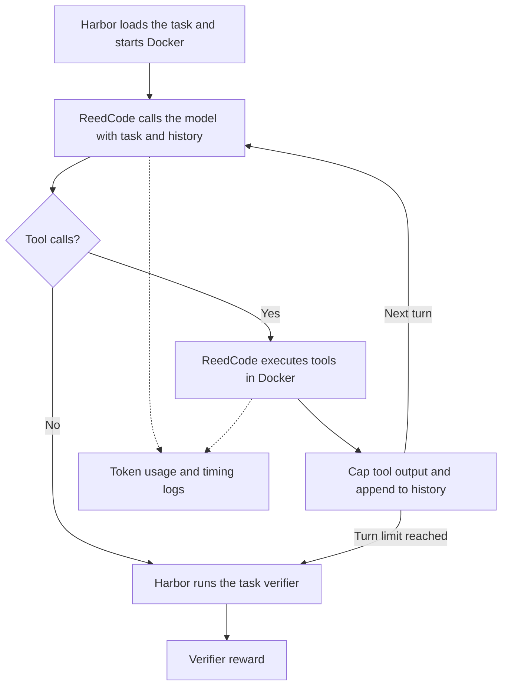

# ReedCode

ReedCode is a small coding-agent harness that runs tools through Harbor and logs token use and timing. I built it to study tool-output retention. [TODO: why I started this]

All 15 trials in the latest study passed. Both 2K policies used less input than 20K. Head+tail used fewer fresh tokens than head-only, but took more tool calls.

## How it works



Harbor handles setup, deadlines, and verification. [`reedcode_harbor_agent.py`](reedcode_harbor_agent.py) calls the model and runs `read_file`, `write_file`, and `bash` in Docker, one at a time. Results stay in the history for later calls.

The agent stops on a final response or budget limit, then Harbor grades the workspace. Tool errors go back to the model; API failures go to Harbor.

## Measurements

JSONL traces record model usage, tool timing, output sizes, and truncation. Harbor supplies the reward.

| Metric | Definition |
| --- | --- |
| Input, cached, and output tokens | API-reported usage summed across completed calls |
| Fresh input tokens | Input tokens minus cached input tokens |
| Model latency | Time spent awaiting complete API responses, summed per task |
| Tool latency | Time spent executing tools, summed per task |
| Tool-output bytes | UTF-8 bytes returned to the model after truncation, including formatting |
| Harbor job runtime | Time from job start to finish, including setup and verification |

## Retention conditions

| Condition | Retained characters |
| --- | --- |
| `head_20k` | First 20,000 |
| `head_2k` | First 2,000 |
| `head_tail_2k` | First 1,000 and last 1,000 |

Exit codes stay visible. The [protocol](experiments/PROTOCOL.md) covers scheduling, task checks, and analysis.

## Interleaved synthetic results

I ran `noisy-bugfix` on September 23, 2026 UTC with harness 0.4.1 and `gpt-5.6-terra` through the Responses API, using the provider's default generation budget. All trials passed the eight-test verifier. The [study record](experiments/synthetic-20260923/README.md) includes every attempt and its outcome.

Token, call, and latency values are means per trial.

| Metric | Head 20K | Head 2K | Head+tail 2K |
| --- | ---: | ---: | ---: |
| Passed / attempted | 5/5 | 5/5 | 5/5 |
| Input tokens | 15,686.0 | 6,525.2 | 7,618.0 |
| Fresh input tokens | 4,952.4 | 3,629.4 | 3,064.8 |
| Output tokens | 420.4 | 389.2 | 369.4 |
| Model calls | 5.8 | 6.0 | 6.0 |
| Tool calls | 6.4 | 6.4 | 7.0 |
| Model API latency | 10.03 s | 11.73 s | 10.43 s |
| Truncated / total tool calls | 0/32 | 9/32 | 12/35 |

Compared with 20K, input fell 58.4% for head-only and 51.4% for head+tail. Mean API latency was higher under both 2K policies.

The paired comparison below is **head+tail minus head-only at 2K**.

| Metric | Mean difference | Exploratory 95% interval |
| --- | ---: | ---: |
| Input tokens | +1,092.8 | [-38.4, +2,079.2] |
| Fresh input tokens | -564.6 | [-906.0, -305.6] |
| Model API latency | -1.30 s | [-4.36, +0.81] s |
| Model calls | 0.0 | [0.0, 0.0], degenerate |
| Tool calls | +0.6 | [+0.2, +1.0] |

Head+tail had more cached input: 4,553.2 versus 2,895.8 tokens per trial. See the full [paired report](experiments/synthetic-20260923/paired_report.json).

## Pilot results

Both earlier suites used `gpt-5.6-terra`. Their oracle checks passed before the model runs.

### Synthetic bugfix

The [original task](evals/noisy-bugfix-pilot) prints 150 diagnostic lines before pytest. Its verifier checked three assertions. All six trials passed: three per cap, harness 0.1.0.

| Mean per run | 20K cap | 2K cap | Change |
| --- | ---: | ---: | ---: |
| Input tokens | 13,881.7 | 5,532.0 | -60.1% |
| Cached tokens | 9,464.3 | 1,948.3 | -79.4% |
| Fresh tokens | 4,417.3 | 3,583.7 | -18.9% |
| Tool-output bytes | 18,607.7 | 5,096.7 | -72.6% |
| Model latency | 13.21 s | 11.99 s | -9.3% |
| Model calls | 6.00 | 6.00 | 0.0% |
| Tool calls | 7.00 | 6.33 | -9.5% |

### Terminal-Bench

After fixing path, timeout, and reporting bugs, I ran each task once per cap with harness 0.2.0. All six passed without Harbor exceptions.

| Task | Cap | Input tokens | Fresh tokens | Model latency |
| --- | ---: | ---: | ---: | ---: |
| `extract-elf` | 20K | 45,203 | 11,022 | 64.88 s |
| `extract-elf` | 2K | 33,427 | 9,262 | 93.14 s |
| `regex-log` | 20K | 67,217 | 8,304 | 112.84 s |
| `regex-log` | 2K | 5,691 | 3,212 | 38.57 s |
| `sanitize-git-repo` | 20K | 297,390 | 39,873 | 98.23 s |
| `sanitize-git-repo` | 2K | 119,649 | 15,069 | 89.62 s |

| Mean per task | 20K cap | 2K cap | Change |
| --- | ---: | ---: | ---: |
| Input tokens | 136,603.3 | 52,922.3 | -61.3% |
| Cached tokens | 116,870.3 | 43,741.3 | -62.6% |
| Fresh tokens | 19,733.0 | 9,181.0 | -53.5% |
| Output tokens | 5,513.7 | 4,813.0 | -12.7% |
| Tool-output bytes | 39,422.7 | 10,146.7 | -74.3% |
| Model latency | 91.98 s | 73.78 s | -19.8% |
| Tool latency | 16.86 s | 8.52 s | -49.4% |
| Model calls | 12.00 | 9.33 | -22.2% |
| Tool calls | 11.00 | 9.33 | -15.2% |

Total Harbor job runtime fell from 420.01 to 346.12 seconds (17.6%), including setup and verification. `sanitize-git-repo` accounts for most of the input difference. `extract-elf` used fewer input tokens at 2K but generated more output and took longer.

## Server measurements and next experiments

Next are the ten-task and [vLLM studies](docs/self-hosted.md), followed by retaining specific errors and test results. Later, I'd like to test whether lifecycle hints from the harness help an inference scheduler.

## Codex profile

This separate `gpt-5.6-terra` Codex run on `terminal-bench/make-mips-interpreter` failed verification with reward 0 and no Harbor exception. [`profile_trajectory.py`](profile_trajectory.py) produced the [profile](experiments/codex_profile/profile.json).

| Metric | Value |
| --- | ---: |
| Commands / failed commands | 20 / 9 |
| File-change events | 10 |
| Cumulative input tokens | 1,598,392 |
| Cached input tokens | 1,528,576 (95.63%) |
| Fresh input tokens | 69,816 |
| Output tokens | 16,912 |
| Reported reasoning output tokens | 6,332 |
| Session-reported duration | 698.05 s |
| Session-reported time to first token | 6.71 s |

## Running it

Requires Python 3.12+, [uv](https://docs.astral.sh/uv/), and Docker for evaluations. Harbor is pinned to 0.23.0 and the OpenAI SDK to 2.54.0.

```bash
uv sync --locked

# Summarize the saved runs. No API key or Docker needed.
python3 summarize_ab.py
python3 summarize_real_ab.py
python3 summarize_ab.py experiments/synthetic-20260923

# Offline tests
uv run python -m unittest discover -s tests -v

# Check the revised synthetic task without model calls
uv run harbor run -p evals/noisy-bugfix -a oracle
docker build -t reedcode-noisy-bugfix-v2 evals/noisy-bugfix/environment
uv run python tests/check_synthetic_container.py

# Inspect the 150-trial schedule without downloads or model calls
uv run python run_experiments.py real --dry-run

# Download and oracle-check the ten tasks without model calls
uv run python run_experiments.py real --check-only
```

Set `OPENAI_API_KEY` for model runs. The default model is `gpt-5.6-terra`; use `MODEL` for another Responses-compatible model and record the change.

```bash
PYTHONPATH="$PWD" uv run harbor run -p evals/hello \
  --agent reedcode_harbor_agent:ReedCodeAgent \
  --model "${MODEL:-gpt-5.6-terra}"

# These use model API credits: 15 synthetic trials, then 150 real-task trials
bash run_ab.sh
bash run_real_ab.sh

# Use the output directory printed by the runner
python3 summarize_real_ab.py runs/real-TIMESTAMP

# Profile a compatible Codex session
python3 profile_trajectory.py /path/to/rollout.jsonl
```

Each invocation creates a study in `runs/`, including `paired_report.json`. Full Harbor output goes in `jobs/`. Both directories are ignored by Git.

| Setting | Default |
| --- | ---: |
| `MAX_TURNS` | 30 model calls |
| `MAX_TOOL_OUTPUT` | 20,000 characters |
| `TOOL_TIMEOUT` | 120 seconds per command |
| `OUTPUT_POLICY` | `head` (`head_tail` also supported) |
| `MODEL_API` | `responses` (`chat` for vLLM) |
| `MAX_OUTPUT_TOKENS` | Unset; provider default |
| `VLLM_METRICS_URL` | Unset; collection disabled |
| `METRICS_SAMPLE_INTERVAL` | 0.1 seconds |

Settings are read at agent creation; Python callers can pass `Settings` directly. The runner fixes turn limits, timeouts, `--model-api`, and `--max-output-tokens` across conditions.

## Limitations

- The new study has five pairs on one easy repair with visible source and tests. Its intervals are exploratory; all-pass results don't prove equal success rates. There is no across-task interval, and the latency interval spans zero.
- The pilots ran every 20K trial first. Task variation and service conditions are mixed into their differences. `regex-log` never hit either cap: its largest outputs were 426 and 457 bytes. The [experiment records](experiments/README.md) cover missing source pins and changing dependencies.
- Hosted cache state was not reset. API latency includes network and service overhead; tokens and call counts don't measure GPU savings or identify recovery actions. The ten-task study and GPU measurements are still pending. The Codex table describes a separate run; its TTFT is a session field, and reasoning tokens are already included in output tokens.
- File checks are lexical; symlinks and `bash` can reach outside the workspace. Use disposable containers without sensitive mounts. Output is collected before truncation, so the cap doesn't limit subprocess memory. The [archived prototype](archive/README.md) runs commands on the host.
