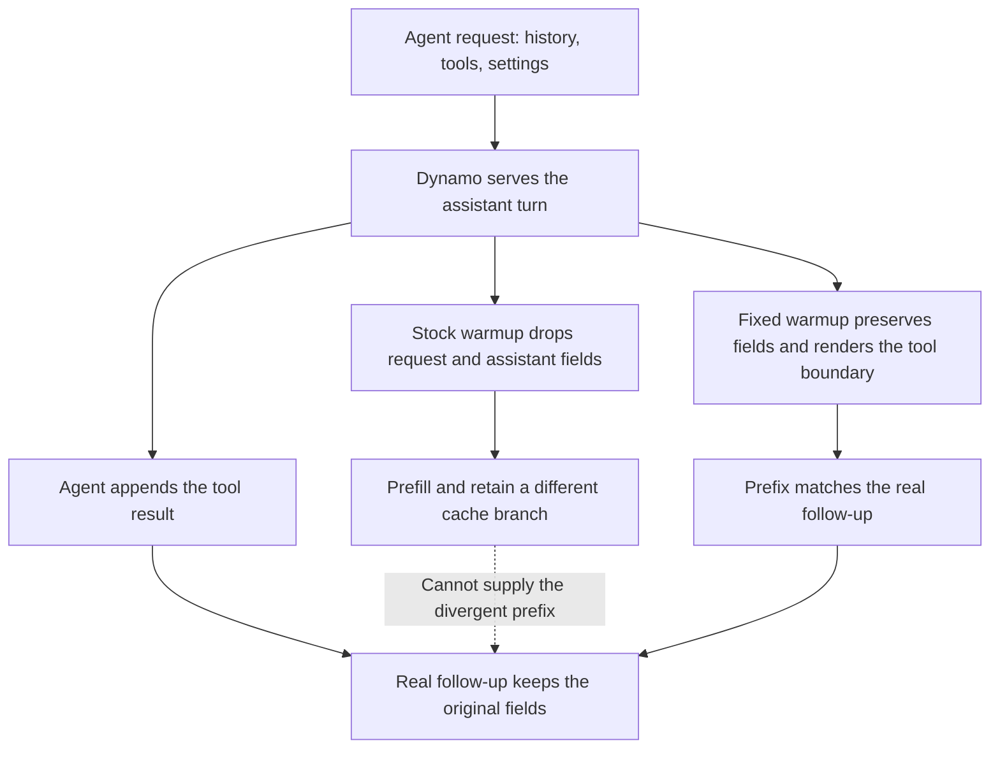

# ReedCode

ReedCode is a coding-agent harness and a set of experiments on agent inference. I built it as a research project for fun, starting with how much tool output an agent needs and following that into token use, prefix caching, and NVIDIA Dynamo.

The strongest finding so far is a bug in Dynamo's `speculative_prefill` agent hint that makes tool-calling agents pay for prefill their next request cannot reuse. On Qwen3-8B on an A100, stock warmups added **62–85% more prefill per session**, with zero extra cache hits on real follow-ups and a warmup-only KV branch of up to **2.4 GiB**. My fix removes that branch.

The work includes a Rust patch, regression tests, real Claude Code and Codex sessions, and captured backend token IDs and KV events. [Issue draft](experiments/dynamo-upstream/001-speculative-prefill/issue-draft.md) · [Patch and tests](experiments/dynamo-upstream/001-speculative-prefill/fix/README.md) · [GPU evidence](experiments/dynamo-upstream/combined-gpu-20260929/README.md)

## Dynamo: wasted speculative prefill

Eighteen controlled GPU trials: two saved sessions, hints off/stock/fixed, three repetitions with rotated order. These whole-session prefill counts repeated exactly in each condition.

| Session | Hint off | Stock hint | Fixed hint | Stock-only KV payload at end |
| --- | ---: | ---: | ---: | ---: |
| Short | 5,205 | 8,446 | 5,240 | 450 MiB |
| Long | 20,580 | 38,114 | 20,595 | 2.4 GiB |

The fix cut prefill **38–46% versus stock**, bringing it close to hint-off cost. Fixed still computes 35 and 15 extra tokens; the useful gain on these tool turns is small. The main improvement is removing the wasted branch, which reached about 98–99% of the real context's full-block KV payload before the final tool output.

[Per-request counts, timings and block accounting](experiments/dynamo-upstream/combined-gpu-20260929/PREFILL.md). The complete GPU study cost about $2.37, including disk and the earlier failed rental.

## Why it happens

The warmup builder copies only the message history. It drops the tool definitions and template settings, then reconstructs the new assistant response from text alone. Its prompt diverges from the real continuation before most of the agent's context.

The same builder is [still on main as of September 29](experiments/dynamo-upstream/001-speculative-prefill/recheck-20260929/README.md).


```mermaid
flowchart TD
    A[Agent request: history, tools, settings] --> B[Dynamo serves the assistant turn]
    B --> C[Stock warmup drops request and assistant fields]
    B --> D[Agent appends the tool result]
    C --> E[Prefill and retain a different cache branch]
    D --> F[Real follow-up keeps the original fields]
    E -. Cannot supply the divergent prefix .-> F
    B --> G[Fixed warmup preserves fields and renders the tool boundary]
    G --> H[Prefix matches the real follow-up]
    H --> F
```

The CPU check reproduced the missing-field problem in Qwen, Nemotron and GPT-OSS templates. Restoring the fields gives exact prefixes in the tested Nemotron and GPT-OSS tool cases. Qwen also needs a renderer-level tool-continuation boundary. The full fix passes **54/54 prefix cases**, leaves ordinary request tokens unchanged, and passes all **19 Dynamo warmup-module tests**. [Scope](experiments/dynamo-upstream/001-speculative-prefill/scope/README.md) · [Implementation](experiments/dynamo-upstream/001-speculative-prefill/fix/README.md)

## The harness and experiments

The agent reads files, edits code, and runs shell commands. Harbor creates its Docker workspace and checks the result with the task's verifier. ReedCode keeps the selected portion of each tool result in the conversation for the next model call. The study records include token use, cache hits, tool output, timing, and verifier rewards.

| Part | What it does |
| --- | --- |
| [Agent harness](reedcode_harbor_agent.py) | Runs the tool loop against hosted APIs, direct vLLM, or Dynamo. |
| [Retention experiments](docs/retention-studies.md) | Compare the first 20,000 characters, the first 2,000, and the first/last 1,000 of each tool result. |
| [Evaluation runner](experiments/PROTOCOL.md) | Interleaves repeated conditions and reports paired differences, call counts, failures, and output-budget stops. |
| [Serving measurements](docs/dynamo.md) | Replay captured requests and measure server prefill, decode, cache use, and the effect of agent hints. |

The first studies used hosted models on a synthetic bugfix and Terminal-Bench tasks. In the later 15-trial synthetic study, all trials passed. Both 2K policies used less input than 20K, but their mean API latency was higher. That led into the server-side work: tracing exactly what gets rendered, computed, and reused. [Study results](experiments/synthetic-20260923/README.md) · [Direct vLLM setup](docs/self-hosted.md) · [All experiments](experiments/README.md)

## What else I found

- **Real harness history changes.** Qwen strips earlier-turn reasoning from Codex's rendered history. Claude Code removes reminder text on resume. Both shorten the reusable prefix. Dynamo reused every compatible full block in the two completed sessions. [Parity report](experiments/dynamo-upstream/combined-gpu-20260929/PARITY.md)
- **A stock 1.5 startup failure.** A frontend with a fixed RPC port failed to register the model. Dynamic port selection worked. The source path has since changed on main. [Failure and source comparison](experiments/dynamo-upstream/006-fixed-rpc-registration/README.md)
- **Missing request linkage.** Warmup requests lack a direct link to the request that triggered them, making their cost and eventual reuse harder to trace. [Observability findings](experiments/dynamo-upstream/005-observability/README.md)
- **A useful negative result.** Across 42 tool continuations, corrected preparation added a median of only 80 tokens. That stopped me from building a scheduling policy for a workload with little to gain. [Survey](experiments/dynamo-prefix/trajectory-survey.md)

## Running it

From the repository root, with Python 3.12+ and [uv](https://docs.astral.sh/uv/):

```bash
uv run --no-project --with msgpack==1.1.1 --with xxhash==3.5.0 python \
  experiments/dynamo-upstream/combined-gpu-20260929/reproduce.py \
  --output /tmp/reedcode-combined-reproduced
```

This checks the hashes and rebuilds both reports from the saved captures. No GPU or model API is needed. It covers all 18 prefill trials, both completed harness sessions and the failed original Claude 32K attempt.

```bash
uv sync --locked
uv run python -m unittest discover -s tests
```

[Dynamo setup](docs/dynamo.md) covers live serving runs. [Harness setup and settings](docs/retention-studies.md#running-it) covers Docker, credentials, task execution, and retention experiments.

## Next

Split the upstream contribution into request/assistant preservation and the renderer continuation hook. Keep the existing GPU result attached to the complete tested fix. Then test whether the extra branch displaces useful prefixes when several real agent sessions share a GPU.

## Limitations

The retention studies cover one synthetic task and initial Terminal-Bench pilots; they do not establish a general latency or quality benefit. The GPU result is a controlled replay on one Qwen3-8B deployment, with one discarded generated token per request and instrumentation enabled. Shared-server latency, eviction pressure and model quality remain unmeasured. KV payload is calculated from full blocks and model geometry; allocator overhead is excluded. Cross-model evidence is CPU-only. The full runtime fix currently supports the pinned Qwen tool template. Codex used 32K context; Claude completed after a 64K YaRN retry. The $2.37 cost is an estimate, including reserves, rather than a settled invoice.
