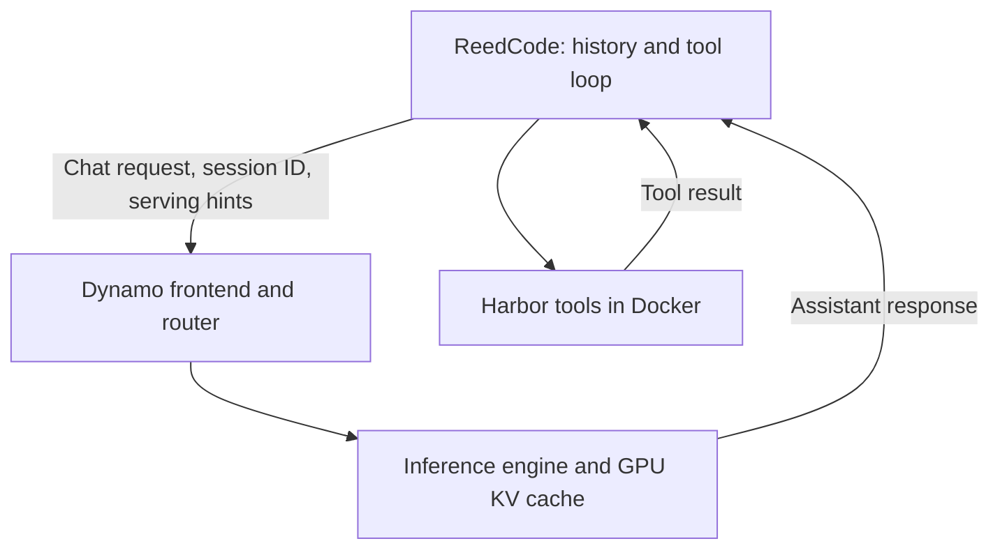

# ReedCode and Dynamo

I started this to test whether information from an agent's tool loop could help Dynamo use GPU memory and compute more efficiently. Testing the existing hints led to a speculative-prefill bug and a local fix.

Work started locally on September 27, 2026. The [first GPU run](../experiments/dynamo-20260928/README.md) followed on September 28 using a rented A100 80GB. The development machine is an Apple Silicon Mac.

**Current priority:** get the [verified Dynamo findings](dynamo-upstream.md) reviewed upstream. The [September 29 GPU check](../experiments/dynamo-upstream/combined-gpu-20260929/README.md) completed the stock-versus-fix comparison and real Claude Code/Codex parity sessions. The patch and reproduction are ready for review. The research studies below remain paused.

## Where the integration sits

ReedCode keeps its agent loop and Harbor containers. Model requests go to a Dynamo frontend, which routes them to an inference engine such as vLLM or SGLang.

The harness knows why an agent is waiting. Dynamo knows where its cached context lives and which workers have capacity. A shared policy could use both when deciding what to prepare and when.

## Part 1: baseline and fix

The first GPU run exercised the client and stock serving path. These are its September 28 results:

| Step | Status |
| --- | --- |
| Session IDs and speculative-prefill off/on requests | Observed in GPU server traces |
| Streamed responses, tool calls, token limits, and session cleanup | Streaming and tools worked on GPU; token limits tested locally; session-final delivery verified |
| Harbor pilot with fixed head 20K retention and optional request capture | 10/10 verifier passes |
| Replay with fixed prompts, tool waits, and concurrent workflows | 40/40 workflows completed on GPU |
| Client timing, whole-epoch vLLM metrics, and reports that retain failures | Client timings saved; server comparisons rejected for missing restart metric |
| Trace preparation and exact prefix reuse through Dynamo | Extra preparation observed; isolated tool prefix shared only two full blocks with the continuation |
| Compare quiet and busy runs on the short pilot | Dropped; richer session evidence comes first |

The [run instructions](dynamo.md) cover the original baseline runner, which uses Dynamo's documented hints.

The [prefix audit](../experiments/dynamo-prefix/README.md) reproduced the mismatch with the pinned Qwen tokenizer. Preserving request fields alone left a template-boundary mismatch. Building the prefix through the closed assistant message fixed it in the recorded cases. This became the local Dynamo patch tested on September 29.

The [follow-up GPU probe](../experiments/dynamo-prefix/gpu-20260928/README.md) confirmed 16 extra cached tokens for the small tool example, 528 for synthetic long arguments, and zero for text. Valid server metrics accounted for all 15 requests in the repeat.

The [local scheduling checks](../experiments/dynamo-headroom/README.md) test ordinary decoding, cache capacity, competing requests, revisions, and cancelled work using synthetic costs.

The September 29 comparison verified cache initialization and used the process-identity helper for the missing restart metric. Across 18 controlled trials, the fix cut scheduled prefill by 37.96% and 45.96% versus stock in the two sessions. Stock warmups added no extra cache hits on real follow-ups. The [report](../experiments/dynamo-upstream/combined-gpu-20260929/PREFILL.md) includes the raw evidence and reproduction.

The [trajectory survey](../experiments/dynamo-prefix/trajectory-survey.md) covers all ten captured coding runs. Across 42 tool continuations, 99.92% of preceding input blocks remain compatible with the next prompt. The corrected candidate adds a median of 80 tokens, with a maximum of 256. Tool waits are 98.96–354.38 ms. These token-compatibility results come from one easy synthetic task.

The [exact boundary check](../experiments/dynamo-prefix/boundary-detail.md) found the same four empty-thinking tokens in every observed mismatch. A constructed probe also showed how removing earlier reasoning can break prefix reuse across user turns.

The [real harness sessions](../experiments/dynamo-upstream/combined-gpu-20260929/PARITY.md) then found no missed compatible prefixes in stock Dynamo. Qwen's reasoning template and Claude's history edits did shorten cross-turn prefixes. Changing either would need a separate quality evaluation.

## Part 2: paused research plan

This was the proposed next step before the upstream bug work took priority.

**Thesis:** a serving policy that knows when an agent can continue, which context it will reuse, and when its plan changes can reduce wasted preparation under memory pressure.

Consider an agent waiting for both tests and a build. Preparing its next-turn context when the tests finish may be too early if the build still needs thirty seconds. If the branch is then cancelled or the history changes, that preparation may never help a real request.

The experimental policy would:

1. Track the dependencies required before the next model call.
2. Identify the known prefix that the next request can reuse.
3. Prepare it near the estimated resume time when capacity permits.
4. Withdraw the preparation intent if the continuation changes or ends.

The engine remains responsible for exact token-prefix identity, residency, references, and safe transfers. A cancelled branch cannot revoke another session's shared cache. Unknown tool results cannot be prefetched as if their contents were already available. Stale or reordered lifecycle events must not revive cancelled work.

Updates during tool waits need a serving-side control path; the Boolean request hint cannot carry them. A first policy would bound speculative capacity, fall back to normal serving, and keep scheduling priority fixed.

### Research stages and stopping points

| Stage | Experiment | Decision |
| --- | --- | --- |
| Find headroom | Controlled replay with sequential tools and context revisions; compare corrected eager preparation with a future-timing diagnostic | Establish extra useful cache work before designing a policy; the diagnostic is not an optimal bound |
| Test the mechanism | Small controller using readiness and context revisions; same prompts, tool delays, and response lengths across policies | Keep only signals that change measured costs or latency |
| Challenge the idea | Compare stock off/on, tuned static timing, progress-only and workflow-aware policies; remove each proposed signal in turn | A simpler policy winning is a useful result |
| Validate | Freeze settings and run held-out workload mixes, then real coding tasks with verifiers | Claim only the workloads and hardware actually measured |

ReedCode and the local sandbox execute each workflow's tools sequentially. Dependency joins are a later extension. The sandbox exercises revisions and cancellation through scripted events; there is no serving-side lifecycle controller yet.

The [protocol](dynamo-headroom-protocol.md) specifies independent epochs, cache resets, failure handling, paired analysis, and the proposed success target. Ordinary decoding already creates cached context. The experiment must distinguish preparing new useful blocks from restoring evicted blocks and from repeating work that is still resident.

### What could be new

Workflow-aware caching, tool-progress signals, and lifecycle cleanup already have prior work. The candidate contribution is the measured value of combining readiness and changing context with resource pressure in coding workflows. Novelty still needs a closer comparison with existing implementations.

Relevant work:

- [KVFlow](https://arxiv.org/abs/2507.07400): workflow structure guides eviction and prefetching.
- [CacheScout](https://arxiv.org/abs/2608.14624): learns agent execution transitions for cache management.
- [Ask the Tool, Don't Guess](https://arxiv.org/abs/2609.18849): live tool progress informs serving decisions.
- [Earlier Dynamo cache-control proposal](https://github.com/ai-dynamo/dynamo/issues/13010): prefetch, demote, and dereference design; closed as not planned when checked September 28, 2026.
- [Session-aware prefix indexer proposal](https://github.com/ai-dynamo/dynamo/issues/13279): connects sessions with exact cached block lineage.

### Streaming tool results

The survey leaves 44,958 continuation tokens after the prepared assistant prefix, including tool output and message framing. A possible follow-up is to prepare stable portions of long tool results while the tool is still running. The current traces record only final results and total durations. They provide no evidence of when those bytes became available.

There is also a format constraint: ReedCode puts the final exit code before stdout. That prefix is unknown until execution ends. Any streaming experiment must explicitly change this serialization and test task quality. With head+tail retention, the tail moves as output grows; preparing every incoming byte could waste most of the work.

If this branch resumes, first capture chunk arrival times from real builds and tests. At each arrival, count the complete blocks that survive in the final retained message. Compare the current format with a separately labeled status-last format. Proceed only if enough final blocks arrive early enough to overlap measured prefill work.

Streaming input itself already exists. [Stream2LLM](https://arxiv.org/html/2604.16395v1) handles append and replacement updates with scheduling under memory pressure. Dynamo's [draft incremental-input proposal](https://github.com/ai-dynamo/dynamo/issues/14476), checked September 28, 2026, defines append, clear, and commit events for ASR text. The candidate question here is whether the harness's retention decisions help avoid preparing tool bytes that will be dropped. That needs a comparison with existing streaming policies before making a novelty claim.
